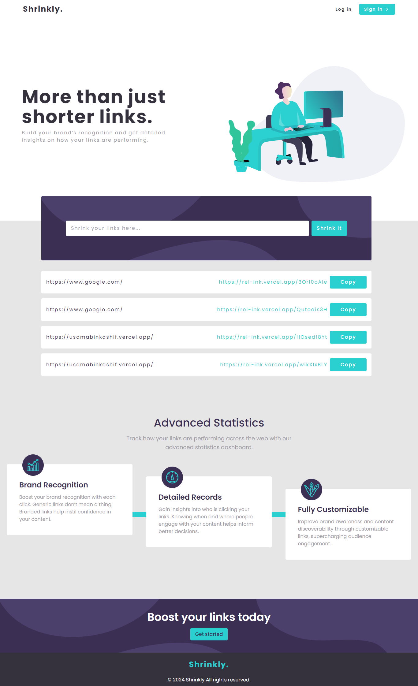

# Shrinkly.

## Architecture


## Technologies

- ### Back end

  - [Express](https://expressjs.com/)- Nodejs framwork for building the REST Apis
  - [Mongodb](http://mongodb.com/)- Document oriented NoSQL database
  - [Mongoose](https://http://mongoosejs.com)- MongoDB object modeling tool
  - [Short-id](https://www.npmjs.com/package/shortid)- Short id generator

- ### Front end

  - [Next JS](https://nextjs.org/) - React JS Framework for building full stack user interfaces.
  - [Tailwind CSS](https://tailwindcss.com/) - Utility-first CSS framework for rapidly building modern websites without ever leaving your HTML.
 

## Getting Started

#### Clone the project

```sh
# clone it
git clone https://github.com/UsamaBinKashif/shrinkly
cd shrinkly
# Make it your own
rm -rf .git && git init
```

#### Run back end

```
# Move to server folder
cd server/
# Install dependencies
npm install

# Start server
npm run dev
```

#### Run front end

```
# Move to client folder
cd client/
# Install dependencies
npm install
# Start  client
npm run dev
```

## Design




## ☑ TODO

- [x] Add User Authentication.
- [x] Create API for shrinked links analytics.
- [x] Writw documentation for API.

